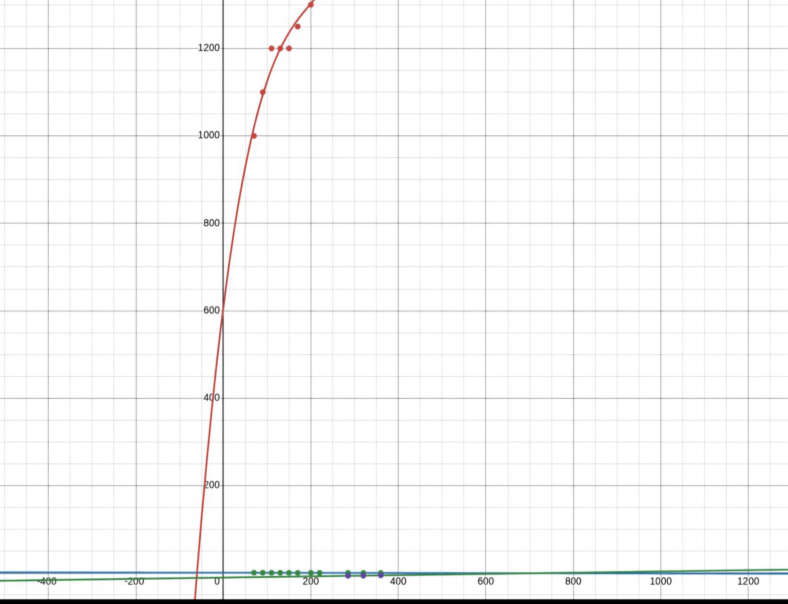
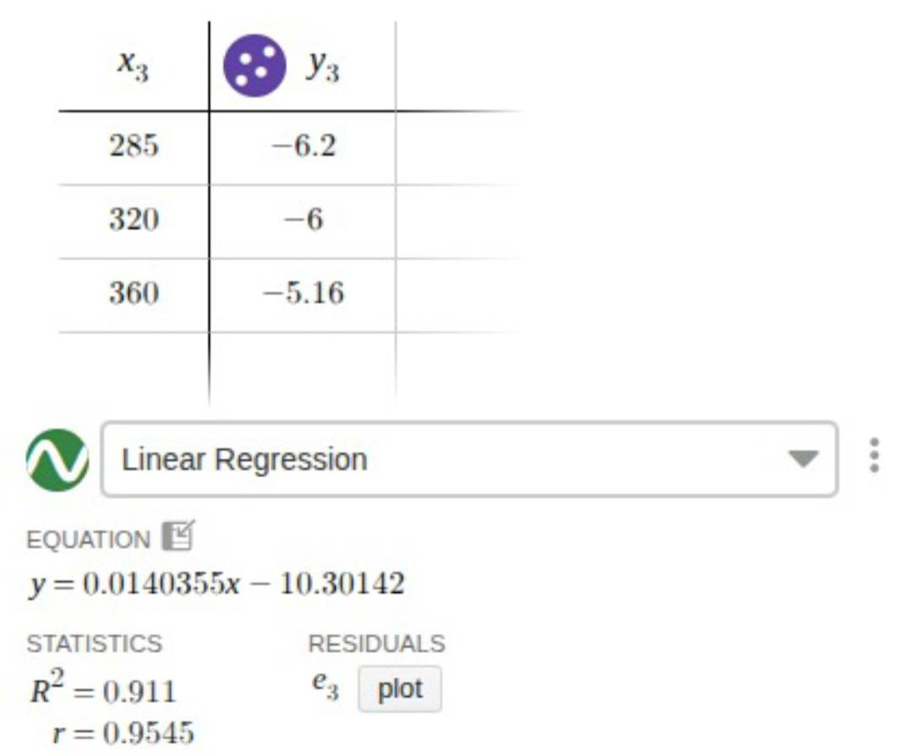

# FTC DECODE 2025-2026 | InfotronX #19119

Competition robot code developed for the **FIRST Tech Challenge DECODE 2025-2026** season by **InfotronX #19119**.

This repository contains our robot software built in **Java** using **Android Studio** and the **FTC SDK**.  
It includes autonomous routines, TeleOp control, subsystem logic, calibration, tuning, vision-based behavior, geometry-based rule validation, and competition-focused automation.

## Overview

This project was used during the **FTC DECODE 2025-2026** season and reflects real competition work developed under time pressure for an official robot.

The codebase includes:
- **Autonomous routines** for different match scenarios
- **TeleOp control** with driver-focused automation
- **Subsystem logic** for robot mechanisms
- **PIDF-based control systems**
- **Vision integration** for object detection and targeting
- **Calibration and tuning workflows**
- **Pose/state continuity** between Autonomous and TeleOp
- **Geometry-based launch validation**
- **Testing and debugging code** used throughout development

This repository represents practical robotics programming focused on reliability, control, precision, match awareness, and real competition performance.

## Screenshots

.jpg)
.jpg)

## What I Worked On

As part of the programming work for this season, I contributed to several advanced technical systems used on the competition robot.

Some of the main areas I worked on include:
- building and tuning control systems for mechanisms
- improving vision-based targeting behavior
- calibrating sensor-based systems using real field measurements
- automating robot actions in both Autonomous and TeleOp
- creating logic for smoother state transitions between match phases
- implementing math-based validation for launch legality

## Advanced Technical Highlights

### 1. Limelight Calibration and Kalman-Based Targeting
One of the most important systems I worked on involved calibrating the **Limelight** for more accurate targeting.

I used field positions at multiple distances from the goal to study the behavior of the measurements and build a more reliable calibration workflow.  
Using those values, I created a graph-based analysis in **Desmos** and tuned the filtering behavior around the data.

This system was used together with a **Kalman-based approach** to improve targeting stability and prediction during matches, especially when dealing with moving game elements.

This work helped turn raw vision input into more useful aiming information for real competition conditions.

### 2. Dual PIDF Control for a Two-Motor Outtake
I also developed and tuned a **PIDF-controlled outtake** powered by **two motors**.

Because the mechanism depended on both motors behaving consistently, the challenge was not just applying PIDF, but making sure both sides stayed synchronized and did not fight each other or run unevenly.

This required:
- tuning both control loops carefully
- correcting differences between the two motors
- improving stability and consistency under load
- making the mechanism move more reliably during real operation

This was a practical control problem involving synchronization, not just a basic single-motor PID implementation.

### 3. Autonomous Final Pose -> TeleOp Start Pose
Another important feature was preserving the robot’s final state from **Autonomous** and using it as the starting reference for **TeleOp**.

Instead of treating the two phases as completely separate, I implemented logic that allowed the final position from Autonomous to become the initial position used in TeleOp.

This improved continuity between match phases and made the robot software feel more like one connected system rather than two disconnected modes.

### 4. TeleOp Automation
I worked on making **TeleOp** as efficient and automated as possible in order to reduce unnecessary driver effort and improve match consistency.

This included logic designed to simplify actions, reduce repeated manual inputs, and support faster in-match operation.

The goal was not only manual control, but a more intelligent driver-assist style workflow.

### 5. Huskylens Color Detection and Automatic Ball Pursuit
Using **Huskylens**, I implemented logic that allowed the robot to detect ball colors and physically turn toward the correct target automatically.

Instead of relying only on fixed positions or random approximations, the robot could use visual information to:
- detect colored game elements
- rotate toward them
- move toward them more accurately in Autonomous

This helped reduce misses caused by imperfect alignment and made autonomous collection behavior more reliable.

### 6. Geometry-Based Launch Zone Validation
Another advanced system I worked on was a **mathematical validation layer** that prevented the robot from launching balls unless it was positioned legally inside the allowed white scoring triangles.

To solve this, I implemented geometry-based checks using **coordinates, triangle areas, inequalities, and determinants**.

The logic included:
- representing the legal launch zones as triangles in field coordinates
- computing triangle areas using determinant-based formulas
- checking whether a point lies inside a triangle through area-based relationships
- analyzing the robot footprint as a square defined by **four points**
- verifying whether the robot’s occupied area overlapped invalidly with the allowed triangle regions

If the robot was not positioned correctly inside the legal launch area, the software blocked the shooting action.

This was a strong example of applying math directly to gameplay constraints:
- coordinate geometry
- determinant-based area computation
- spatial validation
- rule-aware automation

### 7. Control System Prototyping and Mechanism Experiments
During development, I also experimented with additional control solutions, including a **PIDF-based approach for an Axon continuous mechanism** during subsystem prototyping.

Even though that solution was not kept in the final version, it reflects the engineering process behind the robot software:
- testing ideas on real hardware
- evaluating practical usefulness
- keeping what worked best for the final design

## Main Features

- Autonomous routines for competition tasks
- TeleOp control for match operation
- Subsystem-based robot structure
- Dual-motor PIDF control for mechanisms
- Limelight-based targeting improvements
- Kalman-inspired filtering and calibration work
- Huskylens object/color detection
- Automatic ball alignment and pursuit
- Pose transfer from Autonomous to TeleOp
- Driver-assist and TeleOp automation
- Geometry-based launch validation
- Determinant and area-based triangle checks
- Shooting interlock outside legal launch zones
- Testing, debugging, and tuning utilities

## Technologies Used

- **Java**
- **Android Studio**
- **FTC SDK**
- **Limelight**
- **Huskylens**
- **Desmos** (used for calibration analysis and graphing)

## What This Project Shows

This project highlights:
- practical robotics programming
- control systems implementation
- PIDF tuning on real hardware
- sensor calibration and filtering
- vision-based autonomous behavior
- subsystem design
- automation for competitive robotics
- coordinate geometry applied in software
- determinant-based spatial reasoning
- debugging and iteration under real constraints

## Competition Context

This code was developed for a real FTC competition robot during the **DECODE 2025-2026** season.

It reflects the kind of programming work required in a fast-paced robotics environment, where software must interact with hardware, sensors, drivers, match strategy, field conditions, and game-specific constraints.

## Recognition

This repository is part of the work developed during the season in which **InfotronX #19119** earned the **"Nație Prin Educație"** award in FTC Romania.

## Future Improvements

Possible future improvements include:
- cleaner documentation for each subsystem
- more technical breakdowns for advanced features
- match clips or demo videos
- screenshots and code examples
- deeper explanation of calibration and tuning workflows
- visual diagrams for the geometry-based launch validation system

## Author / Team

Developed as part of the **InfotronX #19119** robot codebase for the **FTC DECODE 2025-2026** season.

A significant part of the programming work presented here reflects my contribution in control systems, automation, targeting, geometry-based validation, and technical experimentation.
